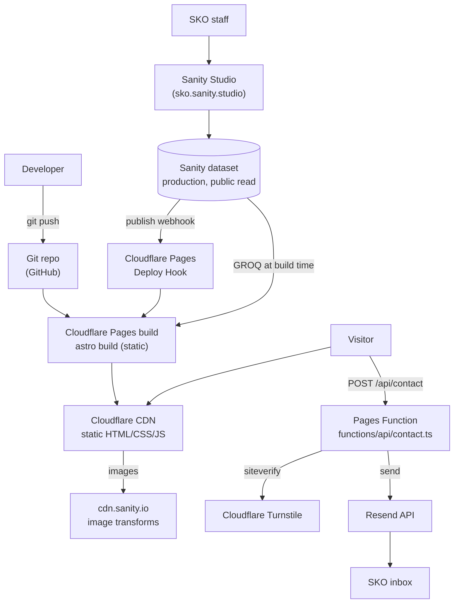

# Phase 1.4 — Tech decisions

## System architecture



Everything a visitor sees is a static file on the edge. The only runtime code is one Pages Function that handles form submissions. There is no origin server, no database at runtime, and no session state.

---

## ADR-001 — Static Astro output with a plain `functions/` directory (no Cloudflare adapter)

**Status:** Proposed

**Context.** The site needs one dynamic endpoint (form submission) but nothing else. Astro offers a Cloudflare adapter with `output: 'server'` or `'hybrid'`, which would let us write the endpoint as an Astro API route.

**Decision.** Keep `output: 'static'` and put the endpoint in a top-level `functions/api/contact.ts`, which Cloudflare Pages picks up automatically regardless of framework.

**Alternatives considered.**
- *Astro Cloudflare adapter, hybrid mode* — one mental model, endpoint co-located with the site. But it pulls a Workers runtime shim into the build, makes every page opt into prerendering explicitly, and introduces a class of "works in dev, fails on the edge" bugs for zero benefit on 40 static pages.
- *Third-party form service (Formspree, Netlify Forms)* — a monthly bill and submitter data sitting on someone else's server.

**Consequences.** ✅ The built site is pure HTML/CSS/JS — nothing can server-error. ✅ Smallest possible attack surface, which is the point of the whole stack choice. ✅ Local dev of the function via `wrangler pages dev dist`. ⚠️ Two dev commands during Phase 3 form work (`astro dev` for pages, `wrangler pages dev` to exercise the function). Acceptable.

---

## ADR-002 — Field-level i18n in Sanity, Astro built-in i18n routing

**Status:** Proposed · Detail in `02-sanity-content-model.md` and `01-sitemap-and-urls.md`.

**Decision.** `{ en, km }` objects on user-facing fields; `defaultLocale: 'en'`, `prefixDefaultLocale: false`; UI strings in `src/i18n/{en,km}.ts` accessed through a typed `t()` helper.

**Consequences.** ✅ One publish action per document — no half-translated pages. ✅ A missing translation is a rendering fallback, not a 404. ⚠️ Taller Studio forms. ⚠️ Adding a third language later means a schema migration (unlikely — this is a Cambodian NGO serving two languages).

---

## ADR-003 — Sanity image CDN for CMS images, `astro:assets` for static assets

**Status:** Proposed

**Context.** Most images come from the CMS and change without a rebuild of the code. Astro *can* optimize remote images at build time, but it would download and re-encode every image on every build.

**Decision.** CMS images go through `@sanity/image-url` → `cdn.sanity.io` with `?w=…&fm=webp&q=75&auto=format`, emitted as a `srcset` at `[400, 640, 828, 1200, 1600]` with correct `sizes`, `width`/`height` (from Sanity's asset metadata, so no layout shift), and `loading="lazy" decoding="async"` on everything below the fold. Hero images get `loading="eager" fetchpriority="high"` and a preload hint. LQIP blur-up placeholders come free from Sanity's asset metadata.

Repo-committed images (logo, illustrations, OG fallback) go through `astro:assets`.

**Alternatives considered.** *Cloudflare Images* — a paid add-on solving a problem Sanity already solves at no cost. *Downloading Sanity images at build* — build time grows linearly with the photo library; a staff member uploading 40 event photos would push builds past ten minutes.

**Consequences.** ✅ Fast builds regardless of media volume. ✅ Global CDN delivery. ⚠️ `img-src` in the CSP must allow `cdn.sanity.io`. ⚠️ One more third-party host on the critical path — mitigated by the fact that Sanity's CDN outage would only degrade images, not the page.

---

## ADR-004 — Public Sanity dataset, no token in the build

**Status:** Proposed

**Context.** The Astro build reads content from Sanity. That read can be authenticated (private dataset + read token) or unauthenticated (public dataset).

**Decision.** Use a **public** `production` dataset. The build fetches with no token. No Sanity credential exists anywhere in CI, in the repo, or in the client bundle.

**Rationale.** Every document in this dataset is content intended for publication on a public website. There is no draft-privacy requirement beyond Sanity's built-in drafts (which are *not* served on a public dataset — drafts live under `drafts.` IDs and are excluded by our GROQ queries and by Sanity's public-read rules). A token that doesn't exist can't leak.

**Consequences.** ✅ Removes the single most common way this stack gets breached — a write token shipped to the browser or committed to a repo. ✅ One less secret for SKO to rotate. ⚠️ Anyone can read the dataset via the API. That's the same content the website publishes. ⚠️ **This is why the safeguarding constraints in the content model are non-negotiable:** nothing sensitive may ever be modelled in Sanity. If SKO later needs private content in the CMS, we revisit this ADR — do not quietly add a token.

Sanity CORS origins still get locked to the production domain + localhost (Phase 5), and the Studio is protected by Sanity's own auth with staff invited individually.

---

## ADR-005 — Turnstile + honeypot + server-side validation for forms

**Status:** Proposed

**Flow:**

1. Form renders server-side as a real `<form>` with a hidden honeypot field (`company_website`, `tabindex="-1"`, `aria-hidden`, CSS-hidden) and a hidden `formType`.
2. Cloudflare Turnstile widget (managed mode) issues a token on interaction. Site key is public; secret key is not.
3. Client POSTs JSON to `/api/contact`.
4. The Function, in order — cheapest rejection first:
   - honeypot non-empty → return generic success, send nothing (don't teach the bot);
   - schema validation with **Zod** (field presence, length caps, email shape, message 20–5000 chars) → 400 with field-level errors;
   - `POST https://challenges.cloudflare.com/turnstile/v0/siteverify` with secret + token + `remoteip` → 403 on failure;
   - rate limit: per-IP counter in **Cloudflare KV**, 5 submissions / 10 min, TTL-expiring keys (free tier covers this comfortably);
   - strip control characters, cap lengths, escape before templating the email body (no HTML injection into the notification mail);
   - `POST` to Resend with `from: noreply@sko-domain`, `to: CONTACT_TO_EMAIL` (or `PARTNER_TO_EMAIL` by `formType`), `reply_to:` the submitter.
5. Response JSON → the page updates an `aria-live="polite"` status region. No redirect, no page reload.

**No data is persisted.** The submission exists in the email inbox and nowhere else. Nothing is logged beyond a counter keyed by hashed IP.

**No file uploads on any form**, including job applications — uploads mean storage, virus scanning, and PII retention for an organization that doesn't need any of it. Careers pages say "email your CV to jobs@…". Flag if you disagree; it's a real trade-off against applicant convenience.

**Consequences.** ✅ Spam-resistant without CAPTCHAs that punish users. ✅ Forms degrade to a visible "email us directly" fallback if JS is off (the address is always printed on the page). ⚠️ Turnstile adds a ~60 KB third-party script on form pages only.

---

## ADR-006 — Self-hosted fonts, subset, with Khmer treated as a first-class script

**Status:** Proposed

**Decision.** Self-host WOFF2 from the repo. No Google Fonts request, no third-party font host.

| Role | Family | Weights | Notes |
|---|---|---|---|
| Latin sans | Inter (or Source Sans 3) | 400, 600, 700 | `font-display: swap`, Latin + Latin-ext subset |
| Khmer | **Kantumruy Pro** | 400, 600, 700 | Designed for UI, has real weights, pairs well with Inter |
| Khmer fallback | Noto Sans Khmer | 400, 700 | Second in the stack |
| Display serif | Source Serif 4 | 600 | Director's pull quote, Latin only |

**Khmer typography rules (enforced in the Tailwind config, not left to judgment):**
- `:lang(km)` gets `line-height: 1.9` (vs 1.6 Latin) — Khmer has subscript consonants and vowel signs above and below the baseline that collide at Latin leading.
- `:lang(km)` font-size steps up ~7% at body sizes — Khmer glyphs read smaller at the same nominal size.
- Never `text-transform`, never `letter-spacing` on Khmer. Both mangle the script.
- `word-break: normal`, no hyphenation. Khmer has no inter-word spaces; the browser's line-breaker handles it, manual intervention breaks words mid-cluster.
- Khmer font files are large (~120 KB WOFF2 for the full range). Preload the 400 weight; load 600/700 with `font-display: swap`.
- **Verification step in Phase 4:** render every page in both locales and confirm no glyph falls back to a system font (checked with a scripted `document.fonts.check()` pass, not by eye).

**Alternatives considered.** *Google Fonts CDN* — one line of code, but a third-party request on every page load, a weaker CSP, and a privacy/GDPR question for European institutional donors. Not worth it.

---

## ADR-007 — Repo hosting and the deploy pipeline

**Status:** Proposed · **needs your input** (see Open Questions)

```
git push main ──────────────────┐
                                ├──► Cloudflare Pages build ──► production (sko.org)
Sanity publish ──► webhook ─────┘
git push (any other branch) ────► Cloudflare Pages build ──► preview URL
Pull request ───────────────────► preview URL + Lighthouse CI comment
```

- **Build command:** `npm run build` → `astro build` → `dist/`
- **Node version:** pinned via `.nvmrc` + `NODE_VERSION` env var (Node 22 LTS — your local is 25.9, which Cloudflare doesn't offer; pinning avoids "works on my machine")
- **Sanity webhook:** fires on create/update/delete/publish of any document type, filtered to exclude drafts, `POST`s to the Pages Deploy Hook URL. Debounced by Cloudflare's own build queue (a staff member publishing three posts in a row triggers one useful build, not three).
- **Nightly rebuild:** a Cloudflare Cron Trigger hitting the deploy hook at 02:00 ICT, so time-sensitive content (expired job deadlines) drops off without anyone touching the CMS. Costs nothing. Recommend including it.
- **Studio deploy:** `npx sanity deploy` → `sko.sanity.studio`, free, staff log in with email. No hosting for us to manage.

---

## Environment variables

`PUBLIC_`-prefixed vars are inlined into the client bundle by Astro. Everything else is server-only. This is the single most important line in the whole document.

| Variable | Scope | Where | Purpose |
|---|---|---|---|
| `PUBLIC_SANITY_PROJECT_ID` | public | build + client | Sanity project |
| `PUBLIC_SANITY_DATASET` | public | build | `production` / `staging` |
| `PUBLIC_SANITY_API_VERSION` | public | build | Pinned date, e.g. `2026-01-01` |
| `PUBLIC_SITE_URL` | public | build | Canonical URLs, sitemap, OG |
| `PUBLIC_TURNSTILE_SITE_KEY` | public | client | Widget. Public by design |
| `TURNSTILE_SECRET_KEY` | **secret** | Function | siteverify |
| `RESEND_API_KEY` | **secret** | Function | Email send |
| `CONTACT_TO_EMAIL` | secret-ish | Function | General inbox |
| `PARTNER_TO_EMAIL` | secret-ish | Function | Grants/partnerships inbox |
| `MAIL_FROM` | config | Function | `noreply@<domain>`, domain-verified in Resend |
| `RATE_LIMIT_KV` | binding | Function | KV namespace binding |
| `PUBLIC_CF_ANALYTICS_TOKEN` | public | client | Web Analytics beacon |

- No Sanity token anywhere (ADR-004).
- `.env.example` is committed with every key present and every value blank. `.env` is git-ignored from the first commit — added to `.gitignore` *before* any env file is created, not after.
- Cloudflare Pages holds production and preview values separately; preview points at a `staging` Sanity dataset if you want one (recommended, costs nothing).

## Performance budget

| Metric | Target | How |
|---|---|---|
| Lighthouse Perf / A11y / BP / SEO | ≥ 90 each, mobile | Enforced in CI on PRs |
| LCP | < 2.0 s on 4G | Preloaded hero + font, no render-blocking JS |
| CLS | < 0.05 | Explicit width/height on every image |
| Total JS (typical page) | < 15 KB gzip | Astro islands only where listed in the component inventory |
| HTML per page | < 60 KB | |

Cambodian mobile networks are the real test environment — the budget is set for 4G, not fibre.

## Risks & mitigations

| Risk | Likelihood | Impact | Mitigation |
|---|---|---|---|
| Real SKO copy/photos arrive late and the site launches full of placeholders | High | High | Every placeholder is literally marked `[PLACEHOLDER]` and CMS-editable; deliver a checklist of exactly which fields need real content before go-live |
| Khmer translation quality — I can produce structure but not authoritative Khmer copy | High | Medium | Khmer placeholder text is marked and must be written/reviewed by an SKO staff member. I will not machine-translate the mission of a child-protection NGO and present it as ready |
| A staff member publishes a photo of an identifiable child | Medium | **Severe** | Consent gate on `story`; field-level guidance in Studio; explicit section in the handover guide; safeguarding reviewed in Phase 5 |
| Domain/DNS not yet owned → Phase 6 blocked | Medium | Medium | Confirm domain ownership now (Open Question) |
| Resend free tier (3k emails/mo, 100/day) exceeded by spam | Low | Low | Turnstile + rate limit sit in front of it; alerting on bounce |
| Sanity free tier limits (20 users, 10 GB assets, 2 datasets) | Low | Low | Well within scope; PDFs are the main asset weight — monitor |
| Cloudflare build minutes (500/mo free) | Low | Low | ~3 min per build, nightly cron + publishes ≈ 60–100 builds/mo |

## Open questions — I need answers before Phase 3, not before Phase 2

1. **Domain** — does SKO already own one? Which registrar? (Determines Phase 6 DNS work and whether we use Cloudflare Registrar at cost.)
2. **Git host** — GitHub, GitLab, or a Cloudflare-hosted repo? Who owns the account long-term? *(An NGO website living in a departing volunteer's personal GitHub is a real failure mode — recommend an SKO-owned org account from day one.)*
3. **Email** — which inbox receives contact vs partner inquiries? Does SKO control DNS for the sending domain (needed to verify Resend and set SPF/DKIM)?
4. **Newsletter** — in scope for v1 or deferred? (Recommend deferred.)
5. **Khmer copy** — who at SKO writes/reviews it, and when?
6. **Routing style** — unprefixed English (`/about/`) or symmetric (`/en/about/`)? Recommendation and reasoning in `01-sitemap-and-urls.md`.
7. **CV uploads on careers** — confirm email-only applications are acceptable.
